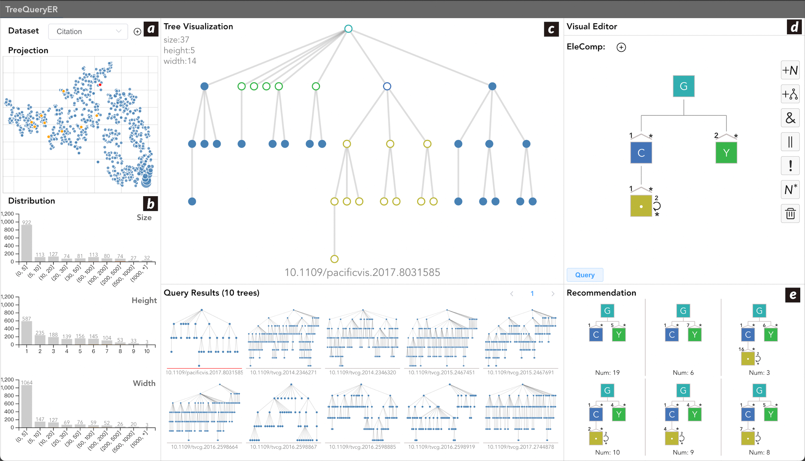

# HiRegEx: Interactive Visual Query and Exploration of Multivariate Hierarchical Data

This is the code repository for HiRegEx/TreeQueryER.

We develop TreeQueryER, a novel visual analytics system that integrates our exploratory framework for multivariate hierarchical data.
TreeQueryER consists of top-down pattern specification, bottom-up data-driven inquiry, and context-creation data overview.
For the top-down mode, we introduce a visual construction approach supporting users in authoring HiRegEx query expressions interactively. 
For the bottom-up mode, we develop a recommendation algorithm based on hierarchical data collection and user-specified query expressions. 
For the context-creation mode, we propose a graph contrastive learning method considering the features of hierarchical data to construct an overview of hierarchical data collection.

**To help understand TreeQueryER, the YouTube URL of the video is:** https://youtu.be/_m4x0639SL4

## Pipeline


The exploratory framework for querying multivariate hierarchical data comprises three modes: top-down, bottom-up, and context-creation. 
The top-down mode starts from a clear query task. Users construct the corresponding query expression through direct manipulations interactively. The bottom-up mode recommends additional related query statements based on the initial expression and the multivariate hierarchical data collection. The context creation mode offers users an overview of the entire hierarchical data collection. Modules associated with the top-down, bottom-up, and context creation modes in the framework are denoted by red, orange, and blue triangles.

## Prototype System

The interface of TreeQueryER prototype system. (a) data collection overview panel. (b) data distribution panel. (c) tree visualization panel. (d) visual editor panel. (e) expression recommendation panel.

## Usage

Here, we provide instructions for reproducing results. To build and run this project on your own, you need to run the back-end and the front-end simultaneously. We offer quick steps to get started.

### Run FrontEnd
```
cd ./FrontEnd
```

Project setup
```
npm install
```

Compiles and hot-reloads for development
```
npm run serve
```

Compiles and minifies for production (only for finishing the whole project)
```
npm run build
```

### Run BackEnd
```
cd ./BackEnd
```

Project setup
```
python communicator.py
```

